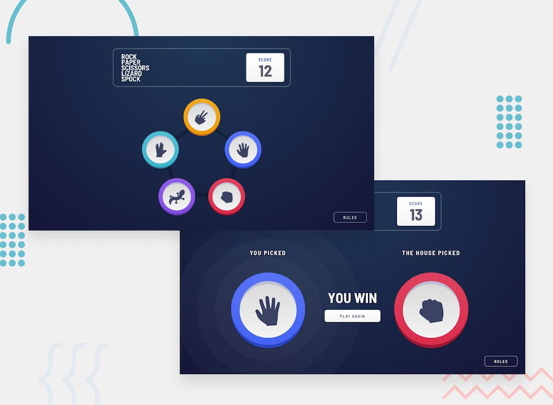
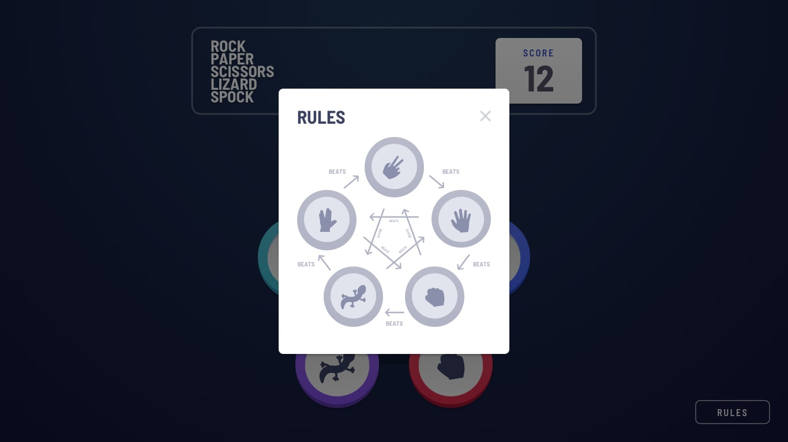

# Frontend Mentor - Rock, Paper, Scissors Solution

This is a solution to the [Rock, Paper, Scissors game challenge on Frontend Mentor](https://www.frontendmentor.io/challenges/rock-paper-scissors-game-pTgwgvgH). Frontend Mentor challenges help you improve your coding skills by building realistic projects.

## Table of contents

- [Overview](#overview)
  - [The challenge](#the-challenge)
  - [Rules](#rules)
  - [Links](#links)
- [My process](#my-process)
  - [Built with](#built-with)
  - [What I learned](#what-i-learned)
- [Author](#author)

## Overview

### The challenge

Build out a Rock, Paper, Scissors game and get it looking as close to the figma design as possible.

Your users should be able to:

- View the optimal layout for the game depending on their device's screen size (mobile or desktop)
- Play Rock, Paper, Scissors, Lizard, Spock against the computer
- Maintain the state of the score after refreshing the browser

### Rules

If the player wins, they gain 1 point. If the computer wins, the player loses one point.

- Scissors beats Paper
- Paper beats Rock
- Rock beats Lizard
- Lizard beats Spock
- Spock beats Scissors
- Scissors beats Lizard
- Paper beats Spock
- Rock beats Scissors
- Lizard beats Paper
- Spock beats Rock

### Links

- Live Site URL: [github pages](https://gerardocianciulli.github.io/Frontend-Mentor-Rock-Paper-Scissors/)

## My process

### Built with

- Semantic HTML5 markup
- CSS custom properties
- Normalize CSS
- Flexbox
- CSS Grid
- jQuery
- HTML Web Storage API
- Media Queries

## Author

- Portfolio - [Gerardo Cianciulli](https://www.behance.net/gerardo-cianciulli)
- Frontend Mentor - [Gerardo Cianciulli](https://www.frontendmentor.io/profile/GerardoCianciulli)
- Linkedin - [Gerardo Cianciulli](https://www.linkedin.com/in/gerardo-cianciulli/)
